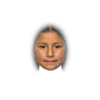
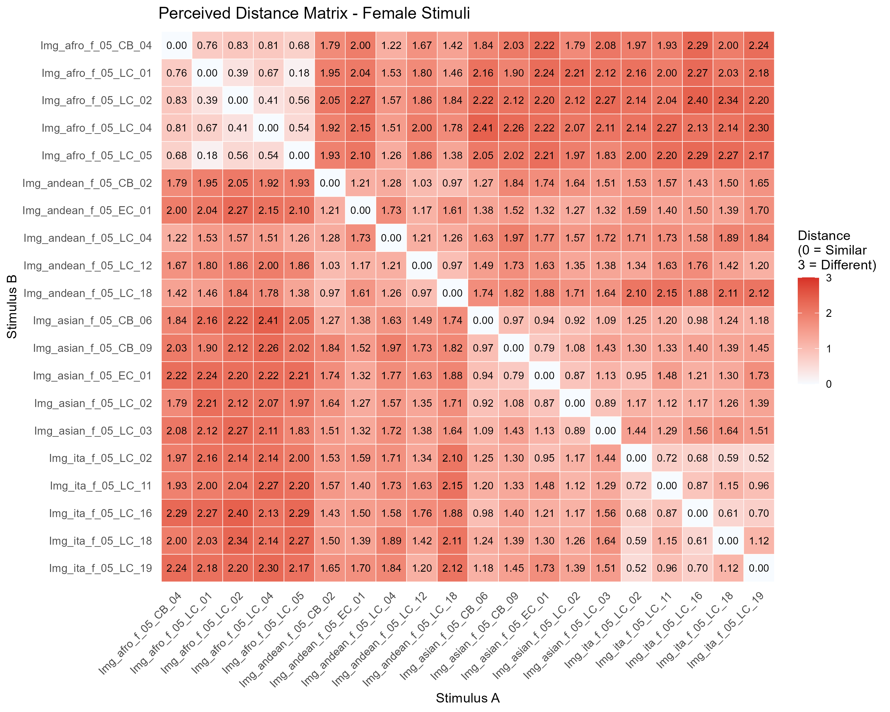
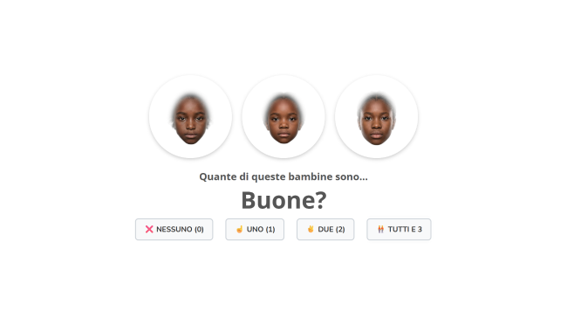
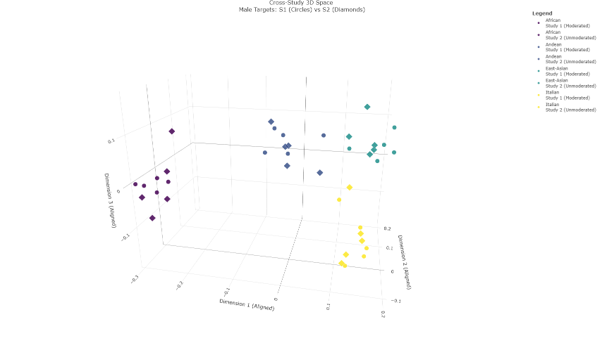
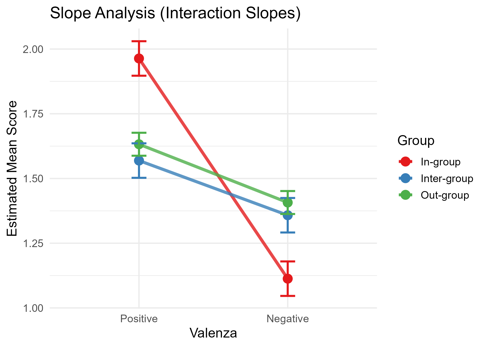

# Dai volti ai gruppi: una mappatura multidimensionale della rappresentazione percettiva dei gruppi sociali nell'infanzia

Luca Cussigh, Luciana Carraro, Luigi Castelli

	
	&nbsp;&nbsp;
	

---

"In 2023, Member States issued more than 3.7 million residence permits to non-EU
citizens from more than 170 countries."

https://www.europarl.europa.eu/doceo/document/E-10-2025-000294-ASW_EN.html

---

# Social Categorization

Social categorization changes how people perceive, evaluate, remember, and treat
one another (Amodio & Cikara, 2021; Levy et al., 2023; Rhodes & Baron, 2019)

---

# The Outgroup Homogeneity Effect

**Early Emergence of Ingroup favoritism vs. Childhood OHE**

- **Ingroup favoritism:** Strong evidence for ingroup preferences and visual specialization for ingroup faces (Kelly et al., 2009; Quinn et al., 2016).
- **OHE in childhoood:** No consolidated evidence for the Outgroup Homogeneity Effect (OHE). Why?

---

# 1. Spontaneous bottom-up categorization

**Multidimensional Scaling (MDS)**

- Face-Space Theory (Valentine et al., 2016): Faces exist in a continuous multidimensional perceptual space
- **Goal**: Visually map whether faces from different ethnic groups are spontaneously perceived as more similar to one another (OHE), and how this changes across age groups.

---

# 2. Multi-group context

- 4-group context: Italian majority-ingroup + 3 distinct ethnic minority-outgroups (African Descent, East Asian, Andean)
- 20 faces per gender group (5 per ethnic group)

---

# 3. The AI generated-stimuli

- Morphologies controlled using an emotional filter and FaceNet embeddings to ensure similar perceptual distinctiveness across groups

| African Descent | East-Asian | Italian | **Andean** |
|:---:|:---:|:---:| :---:|
|  |  |  |  |

 

---

# The Face Similarity Task

| **→** | **→** | **→** | 
|:---:|:---:|:---:|
|  |  |  | 
|800ms|1000ms|//|

---

# The Face Similarity Task

- Incomplete block design 
- 66 random dyads presented sequentially (3 faces per group)

 

---

# The Trait Attribution Task

- 4 positive (Buoni, Belli, Simpatici, Puliti) and 6 negative (Cattivi, Brutti, Antipatici, Sporchi) traits
- 5 possible triads

 

---

# Pre-registered Study

**Sample:**
-  N=249, M=5.17 years, SD=1.23, 134 boys (53.8%) and 115 girls (46.2%)
- Age range: 3 to 8 years
<!--
---

# Pre-registered studies: Method & Experimental Design

---

# The Gamified Task

**Engagement Without Explicit Categorization:**
- Narrative: "Oscar the meerkat" task (no explicit ethnic labels)
- Children evaluate face pairs without social priming
-->

---

# MDS

  <a href="https://lucacussigh.github.io/AIP_Venezia/mds-interactive.html" target="_blank">3D MDS visualization</a>

---

<!--
---

Structural Replicability (S1 vs S2)

**Validating Robustness Across Contexts**

**Procrustes 3D MDS Alignment:**
- Highly consistent structural overlap between moderated (S1) and unmoderated (S2) samples
- Similar spatial arrangements despite different testing contexts

**Quantitative Validation:**
- Tucker congruence indices: >0.93 (excellent agreement)
- Mantel tests: Confirm consistent mapping structures
- **Conclusion:** Perceptual structures are robust, not artifacts of testing context

 Speaker Notes
A critical question is whether these findings depend on the specific testing context. When we aligned the spatial maps from both studies using Procrustes analysis, they overlapped remarkably well. The Tucker congruence coefficients exceeded 0.93, which is well above the threshold for excellent agreement. Mantel tests confirmed that the rank-order distances between groups were consistent across contexts. This replication is crucial—it suggests that the perceptual structures we identified are genuine features of how children organize faces, not artifacts created by experimenter presence or online testing constraints.
-->

---

- # Children spontaneously visually categorized stimuli into ethnic groups

---
# Outgroup Homogenity Effect

- Ellipsoid's volume: 

<!--
---
<!--
# Main Spatial Metrics (OHE)

- 95% variance ellipsoids volumes
- Minimum convex hull 

---

---

# OHE not Supported
- Italian ingroup: Highly concentrated cluster
- African Descent outgroup: Highly concentrated cluster
- Andean outgroup: **Largest dispersion volume** (lowest homogeneity)
- East Asian outgroup: Intermediate compactness

**Interpretation:**
- Perceptual homogeneity ≠ predicted by ingroup/outgroup status

<!-- Speaker Notes
When we mapped the faces in a 3D perceptual space, we found something surprising: the ingroup wasn't perceived as most homogeneous. Instead, the Andean group showed the largest spread—children perceived them as the most diverse-looking group. The Italian ingroup and African Descent groups clustered tightly. This suggests that perceived homogeneity depends on the actual perceptual features of the faces, not simply on whether they're in your ingroup or outgroup. The classic Outgroup Homogeneity Effect didn't emerge.
-->
<!--
---

# Main Spatial Metrics (Minority-groups homogeneity effect)

- Centroid distances
<!--
---

-->
<!--
---

# Minority-groups homogeneity effect not supported

**Key Finding: Minority-groups homogeneity effect NOT Supported**
- Outgroups were NOT closer to each other than to the ingroup
- African Descent group: Structurally most distant from other outgroups
- Ingroup-Outgroup distances: Heterogeneous (not uniformly large)

**What This Means:**
- Minority groups not perceived as interchangeably similar
- Each group occupies distinct perceptual position
- Multigroup structure more complex than binary ingroup/outgroup dichotomy

<!-- Speaker Notes
Regarding the Minority-Groups Homogeneity Effect, we found it wasn't supported either. The African Descent group, for instance, was perceptually quite distant from both East Asian and Andean groups—they didn't cluster together as a unified "outgroup." This tells us that children are sensitive to the specific perceptual characteristics of each ethnic group and don't collapse multiple outgroups into a homogeneous "other." The multigroup perceptual space is richer and more nuanced than traditional categorization models suggest.
-->

---

- # No support for OHE

---

# LMM - Developmental Trajectories

---

# LMM - Developmental Trajectories

---

- # Intergroup dissimilarity judgments increased with age

---

# Ingroup favoritism

| **Moderated (S1)** |
|:---:|
|  |

---

- # Support for ingroup favoritism

---

# Conclusions

- ## Children spontaneously visually categorize stimuli into ethnic groups

- ## No support for OHE

- ## Intergroup dissimilarity judgments might increase with age

- ## Ingroup favoritism supported

<!-- Speaker Notes
When we tracked children across ages 3 to 8, a developmental pattern emerged. As children got older, faces from different groups seemed more dissimilar to them—the distances between intergroup dyads increased. For within-group pairs, we saw some evidence that ingroup faces became more tightly clustered with age, especially in Study 2, suggesting that children develop a more refined, consolidated representation of their own group's appearance. This developmental trajectory aligns with theories of perceptual expertise—as children become more experienced with faces, they become better at extracting the features that distinguish one group from another.
-->
<!--
---

# Discussion & Conclusion

**Main Findings:**
- Visual essentialism & face-space similarity better explain results than OHE/MGHE
- Multigroup perceptual space: Complex, group-specific organization
- Developmental refinement: Intergroup distinctions sharpen with age

**Limitations:**
- Uneven dyad exposures in similarity task
- Perceived threat/cultural factors not directly measured

**Future Directions:**
- Interventions in multicultural schools based on perceptual similarity principles
- Integration with implicit attitude measures
- Longitudinal tracking from early childhood through adolescence

**Broader Implications:**
- Early perceptual categorization ≠ deterministic social bias
- Targeting face-perception mechanisms may offer novel intervention pathways

 Speaker Notes
To wrap up: Our results paint a more nuanced picture of how children perceive ethnic diversity. The classic Outgroup Homogeneity Effect and Minority-Groups Homogeneity Effect didn't emerge as predicted. Instead, children's perceptions are guided by the actual visual features of faces and organized according to face-space principles. Importantly, we see developmental changes—older children distinguish between groups more finely. Of course, our work has limitations: we haven't directly measured threat perception or cultural factors that might moderate these effects. But looking forward, this research opens new doors. Understanding the perceptual foundations of social categorization could inform school-based interventions that leverage face-space similarity principles. By helping children develop more individuated, less stereotypical representations of outgroup members—what researchers call "personalization"—we might reduce intergroup bias from the ground up. Thank you.
-->

---

# Future directions

- Individual differences: Exploring how child-level factors (e.g., social contact, intergroup attitudes) shape perceptual dispersion.

- Task & contextual effects: Investigating whether the number and composition of groups alter face-space geometry.

- Longitudinal trajectories: Tracking individual shifts in categorization and outgroup perceptual boundaries over time.

---

# Questions? 🫰​

---

