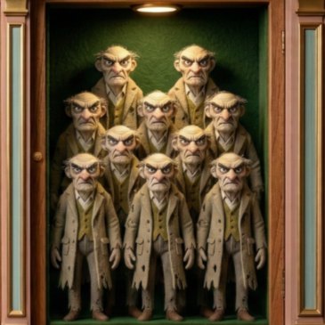
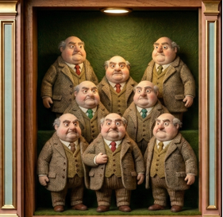
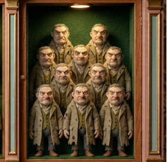
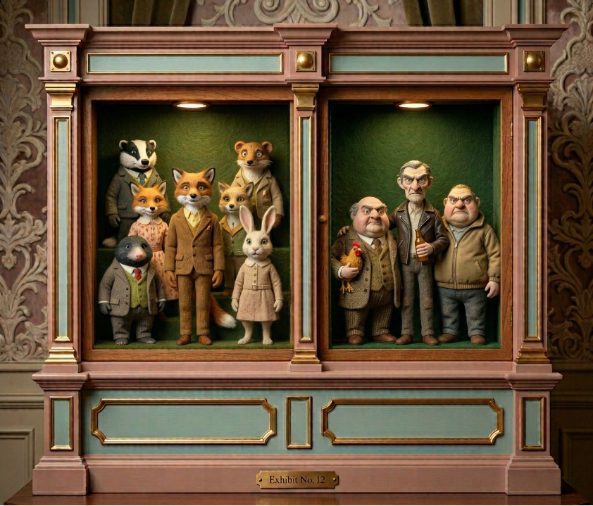
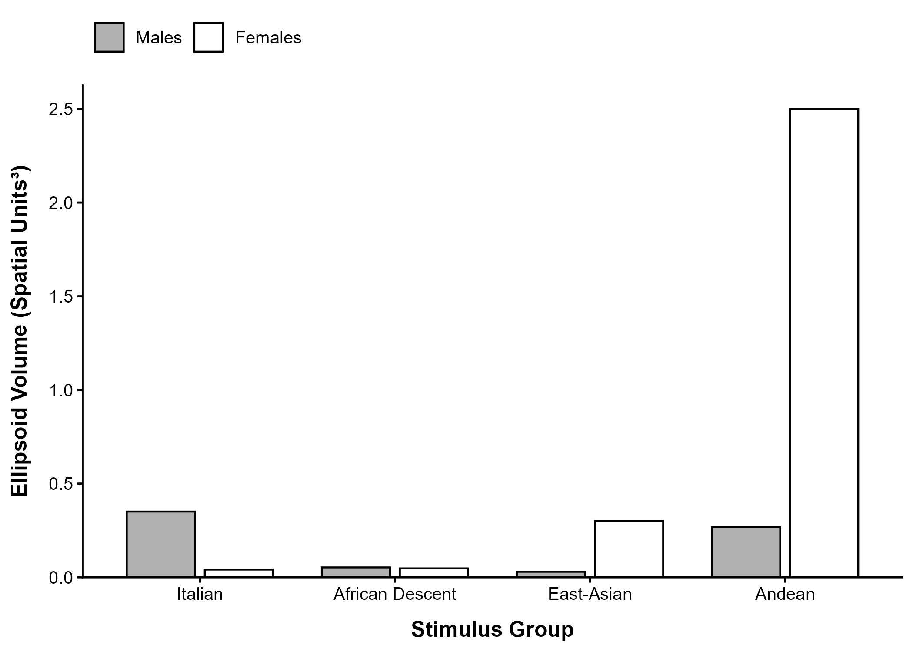
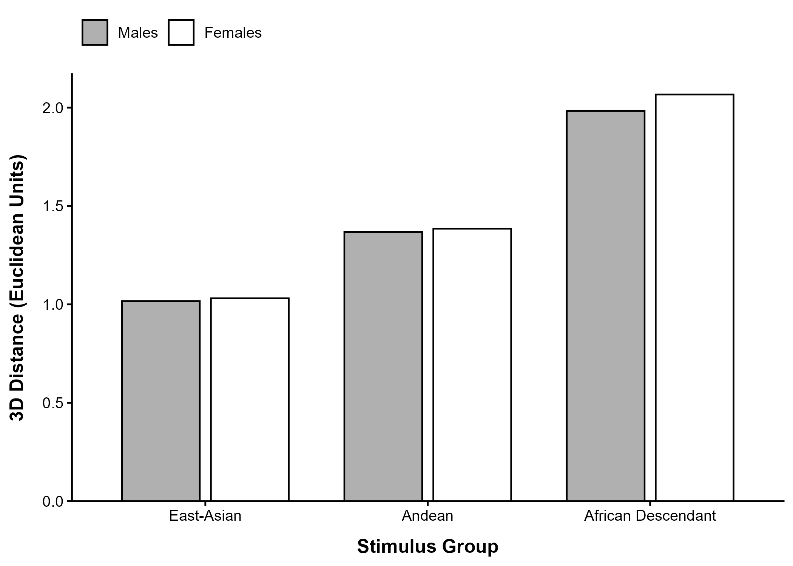
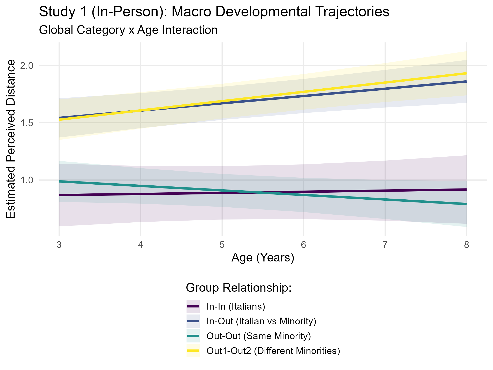

# From Face Perception to Social Categorization: Multidimensional Scaling Approach to Ethnic Outgroup Homogeneity in Childhood

Luca Cussigh, Luciana Carraro, Luigi Castelli

	
	&nbsp;&nbsp;
	

---

"In 2023, Member States issued more than 3.7 million residence permits to non-EU citizens from more than 170 countries."

https://www.europarl.europa.eu/doceo/document/E-10-2025-000294-ASW_EN.html

---

"The study on fiscal impact of migration is a Science for Policy report by the Joint Research Centre, which provides evidence-based scientific support to the European policymaking process. [...]  
The study also finds that removing obstacles to the full labour market integration of migrants can produce considerable positive fiscal benefits for hosting countries in the future."
 https://www.europarl.europa.eu/doceo/document/E-10-2025-002052-ASW_EN.html

---

# Categorization's effects

- Social categorization changes how people perceive, evaluate, remember, and treat one another (Amodio & Cikara, 2021; Levy et al., 2023; Rhodes & Baron, 2019)

<!--
"Social categorization can help children simplify and understand their social environment but has detrimental consequences in the forms of stereotyping, prejudice, and discrimination." - pervasive phenomenon
-->

---

# Why is social categorization a relevant phenomenon in childhood?

- Early-emerging ingroup preferences documented in infants (e.g., Kelly et al., 2009; Woo et al., 2020)
- Visual specialization for ingroup faces (Quinn et al., 2016)
<!--
---

# The Perceptual-Social Linkage
- Infants' visual experience → Later social biases (Lee et al., 2017; Perceptual-Social Linkage Hypothesis)
- Foundation for downstream intergroup attitudes (Timeo et al., 2017)

 Speaker Notes
Let's start with the theoretical foundation. Decades of research show that even infants display ingroup preferences—they look longer at faces of their own race. The Perceptual-Social Linkage Model, developed by Lee and colleagues, proposes that this early visual specialization—our brains becoming finely tuned to process faces we see frequently—has lasting social consequences. The more familiar a face category becomes, the more we perceive it as internally similar and different from outgroups. This early perceptual bias can cascade into social stereotyping and prejudice.

---

Judd & Park (1988) **→** "two different effects of in-group versus out-group status have been discussed and documented."
-->
---

# The Outgroup Homogeneity Effect (OHE; Quattrone & Jones, 1981)

- Outgroup faces appear more homogeneous to each other than ingroup faces

---

# The Outgroup Homogeneity Effect   (with Fantastic Mr.Fox)

| **In-group** | **Outgroup Beans** | **Outgroup Boggins** | **Outgroup Bunce** |
|:---:|:---:|:---:|:---:|
|  |  |  |  |

---

# Minority-groups homogeneity effect (Tepper & Gilovich, 2025)

- In a multigroup scenario
- Majority members see different minority outgroups as MORE similar to each other

---

# Minority-groups homogeneity effect   (with Fantastic Mr.Fox)

---

# The Multigroup Context 

**In children, the situation is slightly different:**
- No formal position consolidated
- Multigroup paradigms are not employed, even though they are more ecologically valid
- **Gap:** We do not know how children categorize faces in a multigroup environment

<!-- Speaker Notes

-->

---

**Research Question:**
- How is the multiethnic perceptual space structured in childhood? Does it support homogeneity theories?
- Does ethnic categorization change across development?

<!--

---

*How to study this effect in a multigroup system with a children population?* 

*How to represent a dynamic representation?*

---

# Study Framework

**Theoretical Shift: From Norm-Based to Exemplar Models**
- Face-Space Theory (Valentine et al., 2016): Faces exist in a continuous multidimensional perceptual space
- Exemplar-based model

<!-- Speaker Notes
Our approach is grounded in Face-Space Theory, which represents faces not as categories but as points in a multidimensional space. Distance in this space reflects perceived similarity. This framework allows us to move beyond simple categorization and examine how multiple groups are positioned relative to each other—capturing the nuances of multigroup contexts. Traditional methods force children into binary choices, but we wanted to measure the entire relational structure of perceived similarity.
-->

---

# Pre-registered studies: Method & Experimental Design

**Sample:**
- Study 1: N=249 (moderated, controlled lab setting)
- Study 2: N=101 (unmoderated, online setting)
- Age range: 3 to 8 years
<!--
---

# Pre-registered studies: Method & Experimental Design

**Stimuli: AI-Generated Faces**
- 20 faces per participant group (5 per ethnic group)
- Groups: Italian (ingroup), African Descent, East Asian, Andean
- Morphologies controlled using an emotional filter and FaceNet embeddings to ensure perceptual distinctiveness
 

 Speaker Notes
We recruited over 350 children across two independent studies—one in a moderated lab setting with trained experimenters, the other online to test whether effects replicate beyond the lab. We used AI-generated faces to ensure strict control over facial features while maintaining naturalness. All faces were validated using FaceNet, a deep learning model trained on human face recognition, to ensure they were perceptually distinct and representative of their intended ethnic categories. The dual-study design allows us to examine whether the perceptual structures we find are robust or dependent on testing context.

---

# The Gamified Task

**Engagement Without Explicit Categorization:**
- Narrative: "Oscar the meerkat" task (no explicit ethnic labels)
- Children evaluate face pairs without social priming
-->

---
# Multidimensional scaling (MDS)

**Expanding the Scope**
- 4-group context: Italian ingroup + 3 distinct ethnic outgroups 
- Relational focus: Facial dyads rather than isolated face evaluation
- Continuous similarity judgments (0-3 scale) instead of binary choices

<!-- Speaker Notes
To address this gap, we employed Multidimensional Scaling—a statistical technique that constructs a spatial map from similarity judgments. Each group becomes a cloud of points in this space; the more compact the cloud, the more homogeneous the group appears. The key innovation is applying this method developmentally across ages 3 to 8, which requires a child-friendly task. We also expanded to a 4-group context, examining not just ingroup versus outgroup, but how multiple minority groups relate to each other and the ingroup.
-->

---

**Face Similarity Task Protocol:**
- Incomplete block design 
- 66 random dyads presented sequentially

<!-- Speaker Notes
To keep young children engaged without explicitly mentioning ethnicity—which could introduce demand characteristics—we embedded the task in a playful narrative. Oscar the meerkat guides children through pairs of faces. Children simply indicate how similar each pair looks using a straightforward 0-to-3 scale with visual anchors. This approach maintains ecological validity while reducing cognitive load. The randomized dyad sampling ensures children evaluate both within-group and between-group comparisons without pattern detection.
-->

---
# The Face Similarity Task

| **→** | **→** | **→** | 
|:---:|:---:|:---:|
|  |  |  | 
|800ms|1000ms|//|

---

# MDS

  <a href="https://lucacussigh.github.io/AIP_Venezia/mds-interactive.html" target="_blank">3D MDS visualization</a>

<!--
---

Structural Replicability (S1 vs S2)

**Validating Robustness Across Contexts**

**Procrustes 3D MDS Alignment:**
- Highly consistent structural overlap between moderated (S1) and unmoderated (S2) samples
- Similar spatial arrangements despite different testing contexts

**Quantitative Validation:**
- Tucker congruence indices: >0.93 (excellent agreement)
- Mantel tests: Confirm consistent mapping structures
- **Conclusion:** Perceptual structures are robust, not artifacts of testing context

 Speaker Notes
A critical question is whether these findings depend on the specific testing context. When we aligned the spatial maps from both studies using Procrustes analysis, they overlapped remarkably well. The Tucker congruence coefficients exceeded 0.93, which is well above the threshold for excellent agreement. Mantel tests confirmed that the rank-order distances between groups were consistent across contexts. This replication is crucial—it suggests that the perceptual structures we identified are genuine features of how children organize faces, not artifacts created by experimenter presence or online testing constraints.
-->

---

- # Children spontaneously visually categorize stimuli in ethnic groups
<!--
---
<!--
# Main Spatial Metrics (OHE)

- 95% variance ellipsoids volumes
- Minimum convex hull 

---

---

# OHE not Supported
- Italian ingroup: Highly concentrated cluster
- African Descent outgroup: Highly concentrated cluster
- Andean outgroup: **Largest dispersion volume** (lowest homogeneity)
- East Asian outgroup: Intermediate compactness

**Interpretation:**
- Perceptual homogeneity ≠ predicted by ingroup/outgroup status

<!-- Speaker Notes
When we mapped the faces in a 3D perceptual space, we found something surprising: the ingroup wasn't perceived as most homogeneous. Instead, the Andean group showed the largest spread—children perceived them as the most diverse-looking group. The Italian ingroup and African Descent groups clustered tightly. This suggests that perceived homogeneity depends on the actual perceptual features of the faces, not simply on whether they're in your ingroup or outgroup. The classic Outgroup Homogeneity Effect didn't emerge.
-->
<!--
---

# Main Spatial Metrics (Minority-groups homogeneity effect)

- Centroid distances
<!--
---

-->
<!--
---

# Minority-groups homogeneity effect not supported

**Key Finding: Minority-groups homogeneity effect NOT Supported**
- Outgroups were NOT closer to each other than to the ingroup
- African Descent group: Structurally most distant from other outgroups
- Ingroup-Outgroup distances: Heterogeneous (not uniformly large)

**What This Means:**
- Minority groups not perceived as interchangeably similar
- Each group occupies distinct perceptual position
- Multigroup structure more complex than binary ingroup/outgroup dichotomy

<!-- Speaker Notes
Regarding the Minority-Groups Homogeneity Effect, we found it wasn't supported either. The African Descent group, for instance, was perceptually quite distant from both East Asian and Andean groups—they didn't cluster together as a unified "outgroup." This tells us that children are sensitive to the specific perceptual characteristics of each ethnic group and don't collapse multiple outgroups into a homogeneous "other." The multigroup perceptual space is richer and more nuanced than traditional categorization models suggest.
-->

---

# LMM - Developmental Trajectories

---

- # Perceptual expertise in discriminating different social groups increases with age

---

- # Perceptual expertise in discriminating different social groups increases with age
- # Intergroup distinctions become more salient

<!-- Speaker Notes
When we tracked children across ages 3 to 8, a developmental pattern emerged. As children got older, faces from different groups seemed more dissimilar to them—the distances between intergroup dyads increased. For within-group pairs, we saw some evidence that ingroup faces became more tightly clustered with age, especially in Study 2, suggesting that children develop a more refined, consolidated representation of their own group's appearance. This developmental trajectory aligns with theories of perceptual expertise—as children become more experienced with faces, they become better at extracting the features that distinguish one group from another.
-->
<!--
---

# Discussion & Conclusion

**Main Findings:**
- Visual essentialism & face-space similarity better explain results than OHE/MGHE
- Multigroup perceptual space: Complex, group-specific organization
- Developmental refinement: Intergroup distinctions sharpen with age

**Limitations:**
- Uneven dyad exposures in similarity task
- Perceived threat/cultural factors not directly measured

**Future Directions:**
- Interventions in multicultural schools based on perceptual similarity principles
- Integration with implicit attitude measures
- Longitudinal tracking from early childhood through adolescence

**Broader Implications:**
- Early perceptual categorization ≠ deterministic social bias
- Targeting face-perception mechanisms may offer novel intervention pathways

 Speaker Notes
To wrap up: Our results paint a more nuanced picture of how children perceive ethnic diversity. The classic Outgroup Homogeneity Effect and Minority-Groups Homogeneity Effect didn't emerge as predicted. Instead, children's perceptions are guided by the actual visual features of faces and organized according to face-space principles. Importantly, we see developmental changes—older children distinguish between groups more finely. Of course, our work has limitations: we haven't directly measured threat perception or cultural factors that might moderate these effects. But looking forward, this research opens new doors. Understanding the perceptual foundations of social categorization could inform school-based interventions that leverage face-space similarity principles. By helping children develop more individuated, less stereotypical representations of outgroup members—what researchers call "personalization"—we might reduce intergroup bias from the ground up. Thank you.
-->

---

# Questions? 🫰​

---

